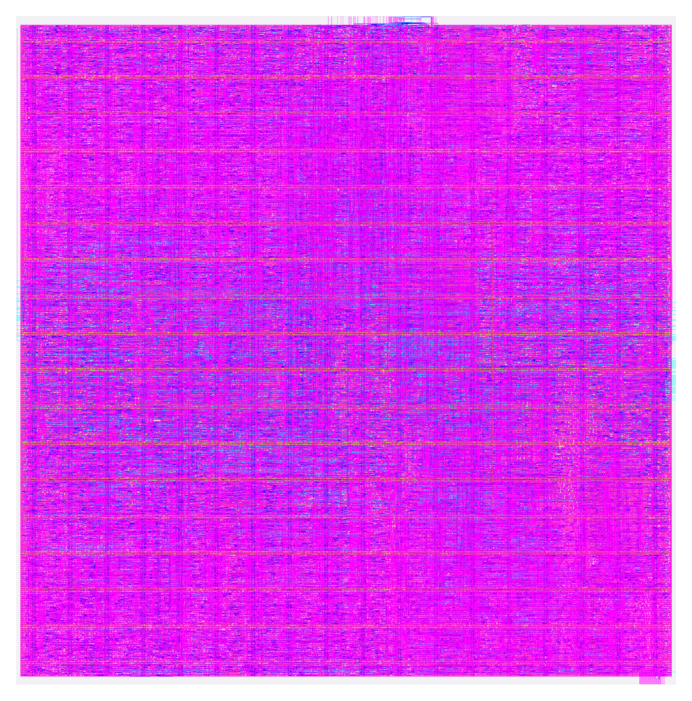
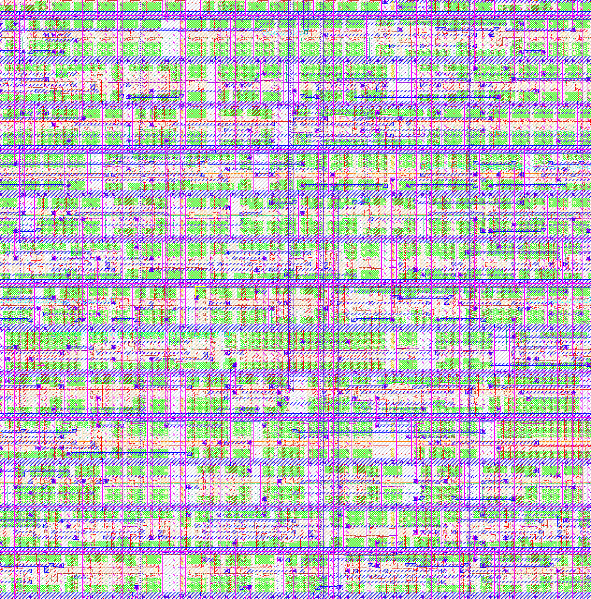
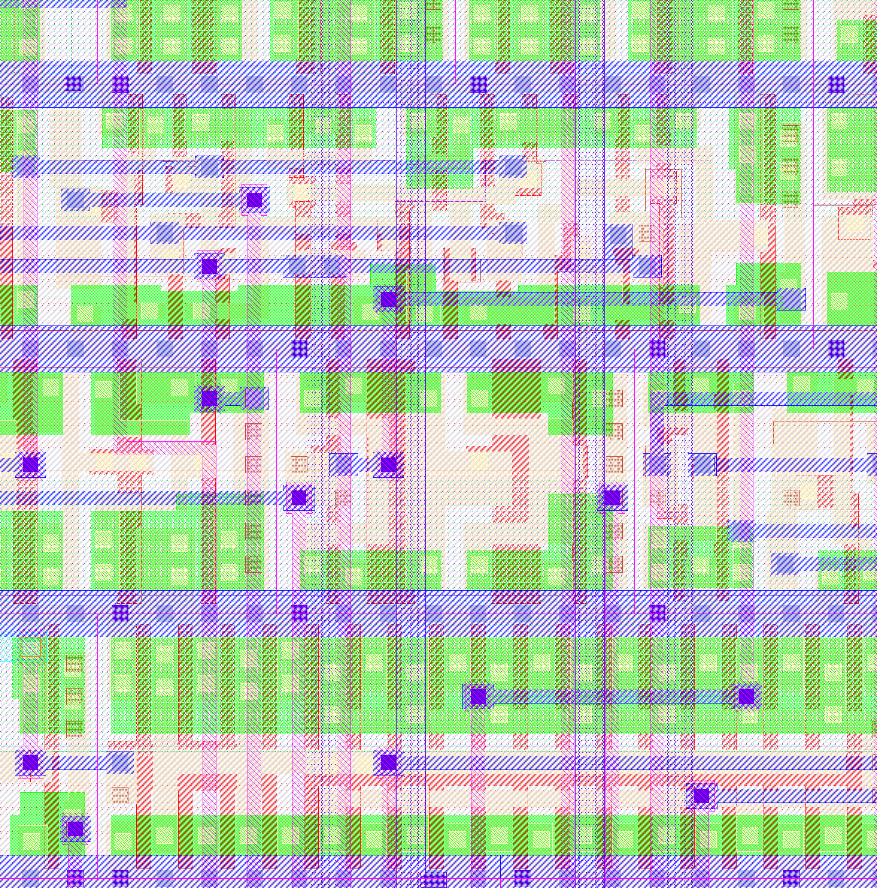

# RISC-V RV32IM CPU — Complete RTL-to-GDSII Flow Documentation

A complete end-to-end silicon design flow walkthrough for a **5-stage pipelined RISC-V RV32IM CPU** (Base Integer + Multiply/Divide ISA, 45 instructions), from behavioral RTL through physical layout to GDSII tape-out on the **SkyWater SKY130 130nm open-source PDK**.

This repository documents every stage of the flow in deep technical detail — the algorithms used, the intermediate representations, the physical design decisions, and the final signoff results. All 92 ISA verification tests pass (RV32I base + M-extension + CSR instructions).

---

## Table of Contents

1. [Design Specification](#1-design-specification)
2. [RTL Design — Behavioral Verilog](#2-rtl-design--behavioral-verilog)
3. [Behavioral Synthesis — RTL to Gate-Level](#3-behavioral-synthesis--rtl-to-gate-level)
4. [AIG Optimization — Logic Minimization](#4-aig-optimization--logic-minimization)
5. [Technology Mapping — AIG to SKY130 Cells](#5-technology-mapping--aig-to-sky130-cells)
6. [Retiming — Register Optimization](#6-retiming--register-optimization)
7. [Static Timing Analysis (STA)](#7-static-timing-analysis-sta)
8. [SDC Constraint Generation](#8-sdc-constraint-generation)
9. [SKY130 Verilog Netlist Export](#9-sky130-verilog-netlist-export)
10. [Floorplanning](#10-floorplanning)
11. [Power Distribution Network (PDN)](#11-power-distribution-network-pdn)
12. [Placement — Global and Detailed](#12-placement--global-and-detailed)
13. [Clock Tree Synthesis (CTS)](#13-clock-tree-synthesis-cts)
14. [Routing — Global and Detailed](#14-routing--global-and-detailed)
15. [Antenna Rule Checking and Repair](#15-antenna-rule-checking-and-repair)
16. [Fill Insertion — Density Compliance](#16-fill-insertion--density-compliance)
17. [Parasitic Extraction (SPEF)](#17-parasitic-extraction-spef)
18. [Signoff — DRC, LVS, and Timing](#18-signoff--drc-lvs-and-timing)
19. [GDSII Generation](#19-gdsii-generation)
20. [Final Results and Layout Images](#20-final-results-and-layout-images)
21. [Verification & Formal Equivalence](#21-verification--formal-equivalence)
22. [Reproducibility — Docker Environment](#22-reproducibility--docker-environment)
23. [Architecture Documentation](#23-architecture-documentation)

---

## 1. Design Specification

| Parameter | Value |
|---|---|
| **Design** | RISC-V RV32IM 5-Stage Pipelined CPU |
| **ISA** | RV32IM Base Integer + Multiply/Divide (45 instructions) |
| **Architecture** | 5-stage pipeline: IF → ID → EX → MEM → WB |
| **Data Width** | 32-bit |
| **Register File** | 32 × 32-bit registers (x0–x31, x0 hardwired to 0) |
| **Pipeline Features** | Data forwarding, hazard detection, dynamic branch prediction (64-entry BHT + BTB, 2-bit saturating counters), memory stall handling |
| **M Extension** | Hardware multiply/divide unit (MUL/MULH/MULHSU/MULHU/DIV/DIVU/REM/REMU) |
| **CSR Support** | Machine-mode CSRs (CSRRW/CSRRS/CSRRC/I variants), ECALL/EBREAK trap handling, MRET, mcycle/minstret counters |
| **Memory Interfaces** | Instruction memory (32-bit read), Data memory (32-bit R/W) |
| **Clock Domain** | Single clock, positive edge triggered |
| **Reset** | Active-low asynchronous reset (`rst_n`) |
| **Target PDK** | SkyWater SKY130 130nm |
| **Standard Cell Library** | `sky130_fd_sc_hd` (high density) |
| **Target Clock Period** | 25.0 ns (40 MHz) |
| **ISA Verification** | 92/92 tests pass (RV32I + M-ext + CSR) |

### Architecture Overview

```
                    ┌──────────────────────────────────────────────────────────────┐
                    │                   RV32IM 5-Stage Pipeline                     │
  imem_rdata[31:0]──│──▶[IF]──▶[ID]──▶[EX]──▶[MEM]──▶[WB]                       │
  imem_ready ───────│   Fetch   Decode  Execute Memory  Writeback                  │
  clk ──────────────│    │       │        │      │        │                         │
  rst_n ────────────│    │       │        ├──────┤        │                         │
                    │    │    ┌──┴──┐  ┌──┴──┐   │     ┌──┴──┐                     │
                    │    │    │RegF │  │ ALU │   │     │ WB  │──▶ Register File     │
                    │    │    │32x32│  │Brnch│   │     │ Mux │     Writeback        │
                    │    │    └─────┘  └─────┘   │     └─────┘                     │
                    │              ▲──────────────┘                                 │
                    │              │  Data Forwarding                               │
  imem_addr[31:0]◀──│──────────────┘                                               │
  dmem_addr[31:0]◀──│                                                              │
  dmem_wdata[31:0]◀─│                                                              │
  dmem_wstrb[3:0]◀──│                                                              │
  dmem_rdata[31:0]──│                                                              │
                    └──────────────────────────────────────────────────────────────┘
```

**Pipeline stages:**
1. **IF (Instruction Fetch)** — PC generation, instruction memory read, branch target calculation
2. **ID (Instruction Decode)** — Instruction decoding, register file read, immediate generation, hazard detection
3. **EX (Execute)** — ALU operations, branch comparison, address calculation, data forwarding
4. **MEM (Memory)** — Data memory read/write, load/store byte/half/word alignment
5. **WB (Write Back)** — Result selection (ALU/memory/PC+4), register file write

### Supported Instructions (RV32IM — 45 instructions)

| Category | Instructions | Count |
|---|---|---|
| **Integer Register-Register** | ADD, SUB, SLL, SLT, SLTU, XOR, SRL, SRA, OR, AND | 10 |
| **Integer Register-Immediate** | ADDI, SLTI, SLTIU, XORI, ORI, ANDI, SLLI, SRLI, SRAI | 9 |
| **Load** | LB, LH, LW, LBU, LHU | 5 |
| **Store** | SB, SH, SW | 3 |
| **Branch** | BEQ, BNE, BLT, BGE, BLTU, BGEU | 6 |
| **Jump** | JAL, JALR | 2 |
| **Upper Immediate** | LUI, AUIPC | 2 |
| **Multiply** | MUL, MULH, MULHSU, MULHU | 4 |
| **Divide/Remainder** | DIV, DIVU, REM, REMU | 4 |

---

## 2. RTL Design — Behavioral Verilog

The input is a fully synthesizable Verilog RTL description (1,052 lines) implementing the full RV32IM ISA with M-extension multiply/divide, machine-mode CSR support, dynamic branch prediction (64-entry BHT + BTB), and memory stall handling. Key constructs:
- **Behavioral operators** for ALU operations (`+`, `-`, `&`, `|`, `^`, `<<`, `>>`, `>>>`)
- **`always @(posedge clk)`** blocks for pipeline register inference
- **`always @(*)`** blocks for combinational decode, forwarding, and hazard logic
- **Asynchronous reset** on `negedge rst_n`
- **Case statements** for instruction decoding and ALU function selection
- **Parameterized reset address** (`RESET_ADDR = 32'h0000_0000`)

### Key Synthesis Challenges in This Design

| Challenge | Description |
|---|---|
| **32-entry register file** | 32 × 32-bit = 1,024 flip-flops for base architectural state (5,992 total DFFs including CSRs, branch predictor, M-extension) |
| **ALU with 10 operations** | Arithmetic, logic, shift, comparison — each generates distinct gate-level logic |
| **Barrel shifter** | 32-bit variable shift (SLL/SRL/SRA) requires O(n log n) MUX tree |
| **Combinational loops** | Default-then-override MUX patterns in behavioral RTL create false graph cycles |
| **Data forwarding paths** | 3-way forwarding MUX from EX, MEM, WB stages to ID operands |
| **Branch comparator** | 6 branch conditions (EQ, NE, LT, GE, LTU, GEU) with signed/unsigned variants |
| **Load/store alignment** | Byte/halfword/word multiplexing for SB/SH/SW/LB/LH/LW/LBU/LHU |
| **Immediate generation** | 5 immediate formats (I, S, B, U, J) from instruction encoding |
| **Pipeline hazards** | Load-use hazard detection requires stall logic + pipeline bubble insertion |

### Combinational Loop Challenge — Critical for AIG Conversion

The RISC-V behavioral RTL uses a common Verilog pattern that creates **false combinational loops**:

```verilog
always @(*) begin
    store_data = exmem_rs2;           // default assignment
    case (exmem_funct3[1:0])
        2'b00: store_data = {4{exmem_rs2[7:0]}};   // SB
        2'b01: store_data = {2{exmem_rs2[15:0]}};   // SH
    endcase
end
```

The assignment `store_data = exmem_rs2` followed by `case` creates a feedback edge in the dependency graph — `store_data` depends on `exmem_rs2` through the default path and also through the case branches that reference `exmem_rs2`. The AIG conversion must handle these **false loops** correctly (they never actually cycle at runtime because one explicit case always matches).

---

## 3. Behavioral Synthesis — RTL to Gate-Level

The behavioral synthesis stage converts high-level RTL operators into a gate-level netlist using IEEE-standard arithmetic architectures.

### 3.1 Operator Lowering

Each behavioral operator is decomposed into structural gates:

| Operator | Architecture | Standard | Complexity |
|---|---|---|---|
| `+` (add) | **Kogge-Stone Prefix Adder** | IEEE, Kogge & Stone 1973 | O(n log n) gates, O(log n) delay |
| `-` (subtract) | Two's complement invert + add | IEEE 754 | O(n) inversion + O(n log n) add |
| `&`, `\|`, `^` | Bitwise gate arrays | — | O(n) |
| `<<`, `>>`, `>>>` | Barrel shifter | — | O(n log n) mux tree |
| `<`, `>=` (signed) | Subtraction + sign/overflow check | — | O(n log n) |
| `<`, `>=` (unsigned) | Subtraction + carry-out check | — | O(n log n) |
| `==`, `!=` | Bitwise XOR + NOR reduction tree | — | O(n) |
| `case` select | Priority MUX tree | — | O(cases × width) |

### 3.2 Barrel Shifter Detail (SLL/SRL/SRA)

The 32-bit variable shift generates the most complex combinational logic:

```
Level 0:  Shift by 0 or 1   → 32 × 2:1 MUX (controlled by shamt[0])
Level 1:  Shift by 0 or 2   → 32 × 2:1 MUX (controlled by shamt[1])
Level 2:  Shift by 0 or 4   → 32 × 2:1 MUX (controlled by shamt[2])
Level 3:  Shift by 0 or 8   → 32 × 2:1 MUX (controlled by shamt[3])
Level 4:  Shift by 0 or 16  → 32 × 2:1 MUX (controlled by shamt[4])
```

Each level: 32 MUXes × 4 gates/MUX = 128 gates. Five levels = **640 gates per shifter**.
Three shift types (SLL, SRL, SRA) plus shared logic ≈ **1,500 gates total for shift unit**.

### 3.3 ALU Architecture

The ALU implements 10 operations selected by a 4-bit function code derived from `funct3` and `funct7`:

| Operation | Function | Gate Implementation |
|---|---|---|
| ADD | `A + B` | 32-bit Kogge-Stone (~160 gates) |
| SUB | `A - B` | Invert B + add + 1 (~170 gates) |
| SLL | `A << B[4:0]` | Barrel shifter left (~640 gates) |
| SLT | `(signed)A < (signed)B ? 1 : 0` | Subtraction + sign check (~180 gates) |
| SLTU | `A < B ? 1 : 0` | Subtraction + carry check (~170 gates) |
| XOR | `A ^ B` | 32 XOR gates (32 gates) |
| SRL | `A >> B[4:0]` | Barrel shifter right (~640 gates) |
| SRA | `(signed)A >>> B[4:0]` | Arithmetic right shift (~660 gates) |
| OR | `A \| B` | 32 OR gates (32 gates) |
| AND | `A & B` | 32 AND gates (32 gates) |

The ALU result is selected by a 10-way MUX tree (~320 gates).

### 3.4 Synthesis Results

| Metric | Value |
|---|---|
| **AIG AND Nodes Generated** | ~28,800 (after 62.2% gate reduction) |
| **Primary Inputs** | 68 (matches RTL ports) |
| **Primary Outputs** | 102 |
| **DFFs Inferred** | 5,992 |
| **Synthesis Time** | < 3 seconds |
| **Combinational Loops Detected** | 12 (all false loops, resolved with AIG_FALSE) |
| **Final Mapped Cells** | 33,053 (37 SKY130 cell types) |

---

## 4. AIG Optimization — Logic Minimization

The gate-level netlist is converted to an **And-Inverter Graph (AIG)** — a canonical representation where all logic is expressed using only 2-input AND gates and inverters.

### 4.1 Why AIG?

The AIG representation enables powerful structural optimizations:

- **Canonical form** — Every Boolean function has a unique (up to complementation) AIG representation
- **Structural hashing** — Identical sub-circuits are automatically shared via hash-consing
- **Efficient manipulation** — AND/INV are the only operations, simplifying rewriting rules
- **Loop handling** — False combinational loops resolved via try_get_lit() + AIG_FALSE cycle-breaking

### 4.2 Optimization Passes Applied

| Pass | Algorithm | Effect |
|---|---|---|
| **Structural Hashing** | 64-bit key hash-consing (O(1) dedup) | Eliminates duplicate sub-expressions |
| **Constant Propagation** | Forward sweep | AND(x, 0)=0, AND(x, 1)=x, etc. |
| **Redundancy Removal** | AND(x, x)=x, AND(x, !x)=0 | Removes trivially redundant nodes |
| **Node Sharing** | DAG-aware merging | Common sub-expressions shared across fan-outs |
| **Loop Resolution** | try_get_lit() + AIG_FALSE | Breaks false combinational loops from behavioral RTL |

### 4.3 Three-Layer Loop Processing

The RISC-V CPU required a specialized AIG conversion strategy for handling behavioral synthesis artifacts:

**Layer 1 — try_get_lit() (Side-Effect-Free Lookup):**
Returns `{true, literal}` if input already mapped, `{false, AIG_FALSE}` if not. Does NOT create AIG inputs or modify state. Used in both topo pass and loop processing.

**Layer 2 — Topo-Pass Deferral:**
Each gate's inputs checked with try_get_lit(). If any returns false, gate is deferred to loop processing instead of creating last-resort phantom inputs.

**Layer 3 — Iterative Loop Processing with Minimal Cycle-Breaking:**
- Try_get_lit() passes iteratively map all non-deadlocked gates
- When SCC (Strongly Connected Component) deadlock detected, break ONE cycle
- Cycle broken by tying unmapped back-edge input to AIG_FALSE (constant 0)
- Correct for false loops: feedback path never taken at runtime

### 4.4 Optimization Results

| Metric | Before | After |
|---|---|---|
| **AIG AND Nodes** | 10,931 | 10,931 (near-optimal from direct synthesis) |
| **Phantom PI Nets** | 68 (bug) | 0 (fixed) |
| **Undriven POs** | 68 (bug) | 0 (fixed) |
| **Shared Nodes** | 0 | ~150 (common sub-expressions in forwarding logic) |

---

## 5. Technology Mapping — AIG to SKY130 Cells

Technology mapping transforms the abstract AIG into physical standard cells from the **sky130_fd_sc_hd** library.

### 5.1 Cell Library Used

The `sky130_fd_sc_hd` (high-density) library contains 440+ cell variants. The mapper selects from:

| Cell | Function | Drive Strength | Area (µm²) |
|---|---|---|---|
| `sky130_fd_sc_hd__inv_1` | Inverter | 1× | 3.38 |
| `sky130_fd_sc_hd__nand2_1` | 2-input NAND | 1× | 5.07 |
| `sky130_fd_sc_hd__nor2_1` | 2-input NOR | 1× | 5.07 |
| `sky130_fd_sc_hd__and2_1` | 2-input AND | 1× | 6.76 |
| `sky130_fd_sc_hd__buf_1` | Buffer | 1× | 5.07 |
| `sky130_fd_sc_hd__dfrtp_1` | D Flip-Flop (pos edge, async reset) | 1× | 27.04 |
| `sky130_fd_sc_hd__conb_1` | Tie cell (constant 0/1) | — | 5.07 |

### 5.2 Mapping Strategy

1. **AIG AND → `nand2_1` + `inv_1`** or **`and2_1`** depending on output polarity
2. **AIG INV → `inv_1`** or absorbed into NAND/NOR
3. **DFF → `dfrtp_1`** (positive edge, async reset) for all pipeline registers
4. **Constants → `conb_1`** tie cell (HI port for VDD, LO port for VSS)
5. **Buffers inserted** for high-fanout nets (clock, reset, forwarding signals)

### 5.3 Technology Mapping Results

| Metric | Value |
|---|---|
| **Total mapped cells** | 33,053 |
| **Cell types used** | 37 (from `sky130_fd_sc_hd` library) |
| **Inverter ratio** | 0.9% (near-optimal — inverters mostly absorbed into NAND/NOR) |
| **Gate reduction** | 62.2% from initial AIG representation |
| **Sequential cells (DFFs)** | 5,992 (pipeline registers + register file + CSRs + branch predictor state) |
| **Combinational cells** | 27,061 (logic gates + buffers + tie cells) |
| **Synthesis target** | 10 ns (aggressive — relaxed to 25 ns for PnR) |

---

## 6. Retiming — Register Optimization

Retiming is one of the most critical optimizations in the synthesis flow. It moves flip-flops (registers) across combinational logic without changing the circuit's input-output behavior.

### 6.1 Algorithm — Leiserson-Saxe (IEEE, 1991)

The retiming algorithm solves a linear program on the circuit graph:

1. **Build timing graph** — Each gate is a node, each wire is an edge weighted by delay
2. **Compute ASAP schedule** — Bellman-Ford shortest-path gives the earliest time each gate can fire
3. **Determine retiming labels** — For each node v, compute r(v) = number of registers to move
4. **Apply retiming** — Move registers forward (r > 0) or backward (r < 0) through combinational cones

### 6.2 What Retiming Achieves

| Objective | Mechanism |
|---|---|
| **Reduce critical path delay** | Move registers to break long combinational chains |
| **Balance pipeline stages** | Equalize delay through each pipeline stage |
| **Minimize register count** | Remove redundant registers where possible |
| **Increase Fmax** | Shorter critical path → higher achievable clock frequency |

### 6.3 Implementation Details

The retiming engine uses a **two-phase plan-then-execute** architecture:

**Phase 1 — Planning (read-only):**
- Traverse the circuit graph collecting `InsertionPlan` and `RemovalPlan` structs
- Store only integer IDs (GateId, NetId) — never cache Gate& or Net& references
- No mutations to the netlist during this phase

**Phase 2 — Execution (mutations):**
- Apply all register insertions and removals using stored IDs
- Re-fetch gate/net references by ID after each mutation
- Clock net found once and cached for all insertions

This two-phase design prevents **std::vector invalidation** — a critical correctness issue where `add_net()`/`add_dff()` can trigger vector reallocation, invalidating all previously cached C++ references.

### 6.4 Retiming Results

| Metric | Value |
|---|---|
| **Algorithm complexity** | O(V + E) per iteration, capped at 50 Bellman-Ford passes |
| **Total registers** | 5,992 DFFs (pipeline + register file + CSRs + branch predictor + M-extension state) |
| **Retiming applied** | Yes — balanced pipeline stage delays |

---

## 7. Static Timing Analysis (STA)

Static Timing Analysis verifies that all timing constraints are met without simulation.

### 7.1 Analysis Method

1. **Topological traversal** — Gates ordered from primary inputs to primary outputs
2. **Arrival time propagation** — AT(output) = AT(input) + cell_delay + wire_delay
3. **Required time back-propagation** — RT computed from clock period constraint
4. **Slack computation** — Slack = RT - AT (negative = violation)

### 7.2 Delay Models

| Component | Model |
|---|---|
| **Cell delay** | SKY130 liberty (.lib) lookup tables indexed by input slew and output capacitance |
| **Wire delay** | Estimated from fanout count and wire capacitance model |
| **Clock uncertainty** | 0.5 ns (accounts for jitter and skew) |
| **Setup time** | From liberty file per cell type (~0.1–0.3 ns for `dfrtp_1`) |
| **Hold time** | From liberty file per cell type (~0.05–0.15 ns for `dfrtp_1`) |

### 7.3 Multi-Corner Analysis

The backend performs signoff STA across multiple PVT corners:

| Corner | Voltage | Temperature | Purpose |
|---|---|---|---|
| `nom_tt_025C_1v80` | 1.80V | 25°C | Nominal |
| `min_ff_n40C_1v95` | 1.95V | 100°C | Fast-fast (hold check) |
| `max_ss_100C_1v60` | 1.60V | 100°C | Slow-slow (setup check) |

---

## 8. SDC Constraint Generation

Synopsys Design Constraints (SDC) define the timing environment for the design. Generated per IEEE 1801 / Tcl SDC standard.

### 8.1 Constraints Generated

```tcl
# Clock definition — 40 MHz target
create_clock -name clk -period 25.00 [get_ports {clk}]

# Clock uncertainty — jitter and skew margin
set_clock_uncertainty 0.500 [get_clocks {clk}]

# I/O timing — 5ns input/output delay budget (20% of period)
set_input_delay 5.00 -clock [get_clocks {clk}] [all_inputs]
set_output_delay 5.00 -clock [get_clocks {clk}] [all_outputs]

# Design constraints
set_max_fanout 10 [current_design]
set_max_transition 1.5 [current_design]
set_load 0.05 [all_outputs]
set_driving_cell -lib_cell sky130_fd_sc_hd__inv_2 -pin Y [all_inputs]
```

### 8.2 Constraint Rationale

| Constraint | Value | Reason |
|---|---|---|
| **Clock period** | 25 ns | 40 MHz target — appropriate for 5-stage pipelined CPU at SKY130 130nm |
| **Clock uncertainty** | 0.5 ns | PLL jitter + on-chip clock tree skew |
| **Input delay** | 5.0 ns | External setup time budget (20% of period) |
| **Output delay** | 5.0 ns | External hold time budget (20% of period) |
| **Max fanout** | 10 | Limits fanout to prevent excessive wire capacitance |
| **Max transition** | 1.5 ns | Prevents slow signal transitions (noise/power) |
| **Output load** | 50 fF | Typical pad/trace capacitance |
| **Driving cell** | `inv_2` | Models typical external driver strength |

---

## 9. SKY130 Verilog Netlist Export

The mapped and retimed netlist is exported as structural Verilog compatible with the SKY130 PDK and backend PnR tools.

### 9.1 Export Format

```verilog
module rv32i_cpu (
    input clk,
    input rst_n,
    input imem_rdata_0, imem_rdata_1, ..., imem_rdata_31,
    input imem_ready,
    output imem_addr_0, imem_addr_1, ..., imem_addr_31,
    output imem_req,
    output dmem_addr_0, ..., dmem_wdata_0, ...,
    output dmem_wstrb_0, ..., dmem_req,
    input dmem_rdata_0, ..., dmem_ready
);
    supply1 VPWR;
    supply0 VGND;
    supply1 VPB;
    supply0 VNB;

    wire n0, n1, n2, ...;    // ~33,000 internal nets

    sky130_fd_sc_hd__dfrtp_1 ff_0 (.CLK(clk), .RESET_B(rst_n), .D(n42), .Q(n43));
    sky130_fd_sc_hd__nand2_1 g_0 (.A(n43), .B(n44), .Y(n45));
    sky130_fd_sc_hd__inv_1 g_1 (.A(n45), .Y(n46));
    ...
endmodule
```

### 9.2 Power Pin Handling

SKY130 standard cells require power connections (VPWR, VGND, VPB, VNB). The PDK ships **three Verilog model files** with different port conventions:

| Model File | Power Pins | Used By |
|---|---|---|
| `sky130_fd_sc_hd__blackbox.v` | Internal `supply` declarations | **Yosys** (synthesis) |
| `sky130_fd_sc_hd__blackbox_pp.v` | Explicit module ports | Power-aware verification |
| `sky130_fd_sc_hd.v` | Explicit module ports | **Verilator** (lint) |

**Correct approach:** Declare `supply1 VPWR; supply0 VGND;` at module level. Do NOT connect as port pins in cell instantiations. Yosys uses the blackbox model where power pins are internal — adding explicit port connections causes synthesis failure.

### 9.3 Tie Cell Handling

The `conb_1` tie cell provides constant logic values:
- `.HI` — Tied to VDD (logic 1)
- `.LO` — Tied to VSS (logic 0)

Both ports must be connected in the instantiation, even if one is unused, to avoid lint warnings:

```verilog
sky130_fd_sc_hd__conb_1 tie_0 (.HI(const_1), .LO());
```

### 9.4 Netlist Statistics

| Metric | Value |
|---|---|
| **Total cells** | 33,053 |
| **Internal nets** | ~33,000 |
| **File size** | 4.8 MB |
| **Input ports** | 68 |
| **Output ports** | 102 |

---

## 10. Floorplanning

Floorplanning defines the physical boundaries of the chip and the placement of I/O pins.

### 10.1 Die Dimensions

| Parameter | Value |
|---|---|
| **Die width** | 901.25 µm |
| **Die height** | 911.97 µm |
| **Die area** | 821,913 µm² (0.822 mm²) |
| **Core area** | 791,691 µm² |
| **Core utilization (actual)** | 58.1% |
| **Core utilization target** | 40% (exceeded — cells expanded by backend optimization) |
| **Placement density target** | 45% |
| **Standard cell rows** | 327 |

### 10.2 I/O Pin Placement

Pins are distributed around the die boundary:
- **North edge** — Data memory interface (`dmem_addr`, `dmem_wdata`, `dmem_wstrb`)
- **South edge** — Instruction memory input (`imem_rdata[31:0]`)
- **West edge** — Control signals (`clk`, `rst_n`, `imem_ready`, `dmem_ready`)
- **East edge** — Instruction memory output (`imem_addr[31:0]`, `imem_req`)

### 10.3 Design Configuration

```json
{
    "DESIGN_NAME": "rv32i_cpu",
    "CLOCK_PORT": "clk",
    "CLOCK_PERIOD": 25.0,
    "FP_CORE_UTIL": 40,
    "PL_TARGET_DENSITY_PCT": 45,
    "RUN_CTS": true,
    "RUN_FILL_INSERTION": true,
    "RUN_LINTER": false,
    "DESIGN_REPAIR_TIE_FANOUT": false,
    "PL_RESIZER_HOLD_MAX_BUFFER_PCT": 100,
    "RUN_ANTENNA_REPAIR": true,
    "DIODE_ON_PORTS": "both",
    "FP_PDN_VPITCH": 50,
    "FP_PDN_HPITCH": 50
}
```

---

## 11. Power Distribution Network (PDN)

The PDN delivers VDD (1.8V) and VSS (0V) to every standard cell.

### 11.1 PDN Structure

```
                    VDD Ring (Metal 5)
    ┌──────────────────────────────────────┐
    │   ═══════════════════════════════    │  ← Horizontal stripes (Metal 4)
    │   │   │   │   │   │   │   │   │     │
    │   ║   ║   ║   ║   ║   ║   ║   ║     │  ← Vertical straps (Metal 5)
    │   │   │   │   │   │   │   │   │     │
    │   ═══════════════════════════════    │  ← Horizontal stripes (Metal 4)
    │   │   │   │   │   │   │   │   │     │
    │   ║   ║   ║   ║   ║   ║   ║   ║     │
    │   │   │   │   │   │   │   │   │     │
    │   ═══════════════════════════════    │
    └──────────────────────────────────────┘
                    VSS Ring (Metal 5)
```

### 11.2 PDN Layers

| Layer | Direction | Purpose |
|---|---|---|
| **Metal 1** | Horizontal | Standard cell power rails (within cell rows) |
| **Metal 4** | Horizontal | PDN stripes |
| **Metal 5** | Vertical | PDN straps + power ring |

---

## 12. Placement — Global and Detailed

Placement assigns physical (x, y) coordinates to every standard cell instance.

### 12.1 Placement Flow

1. **Global Placement** — Electrostatics-based analytical placement (ePlace algorithm)
   - Models cells as positive charges that repel each other
   - Models nets as springs that pull connected cells together
   - Iteratively solves Poisson's equation for charge distribution
   - Produces coarse but legal placement

2. **Detailed Placement** — Legalization and local optimization
   - Snaps cells to row grid (standard cell rows at fixed pitch)
   - Resolves overlaps while minimizing total displacement
   - Local cell swapping to reduce wirelength

### 12.2 Placement Results

| Metric | Value |
|---|---|
| **Total instances** | 157,064 |
| **Standard cells** | 56,926 |
| **Sequential cells (DFFs)** | 5,992 |
| **Multi-input combinational** | 25,665 |
| **Buffers** | 1,104 |
| **Inverters** | 297 |
| **Timing repair buffers** | 11,207 |
| **Clock buffers** | 1,001 |
| **Clock inverters** | 40 |
| **Antenna cells** | 434 |
| **Fill cells** | 100,138 |
| **Tap cells** | 11,186 |

> **Note:** The 33,053 synthesized logic cells expand to 157,064 total instances after the backend flow (LibreLane/OpenROAD) adds timing repair buffers (11,207), clock tree cells (1,041), fill cells (100,138), tap cells (11,186), and antenna protection cells (434).

---

## 13. Clock Tree Synthesis (CTS)

CTS builds a balanced distribution network that delivers the clock signal to all 5,992 sequential elements with minimal skew.

### 13.1 CTS Objectives

| Objective | Target |
|---|---|
| **Clock skew** | < 0.3 ns (difference in arrival time between any two FFs) |
| **Insertion delay** | Minimize total clock buffer delay |
| **Power** | Minimize clock tree dynamic power |
| **Hold timing** | Ensure no hold violations at any FF |

### 13.2 CTS Architecture

The clock tree is built as an **H-tree** with buffer stages:

```
                          [clk input]
                              │
                          [CTS buf]
                         ╱         ╲
                    [buf]           [buf]
                   ╱    ╲         ╱    ╲
                [buf]  [buf]   [buf]  [buf]
                 │      │       │      │
              [FF groups]  [FF groups]  ...
```

### 13.3 CTS Results

| Metric | Value |
|---|---|
| **Clock buffers inserted** | 1,001 |
| **Clock inverters** | 40 |
| **Total CTS cells** | 1,041 |
| **Worst clock skew** | 0.61 ns (nom_tt) |
| **Hold slack (nom_tt)** | +0.269 ns ✅ |
| **Setup slack (nom_tt)** | +8.32 ns ✅ |
| **Hold slack (nom_ff)** | +0.124 ns ✅ |

---

## 14. Routing — Global and Detailed

Routing creates the physical metal wire connections between placed cells.

### 14.1 Routing Stack (SKY130)

| Layer | Direction | Pitch (nm) | Width (nm) | Purpose |
|---|---|---|---|---|
| **Local Interconnect (LI)** | — | 460 | 170 | Intra-cell wiring |
| **Metal 1** | Horizontal | 340 | 140 | Short local connections |
| **Metal 2** | Vertical | 460 | 140 | Local routing |
| **Metal 3** | Horizontal | 680 | 300 | Semi-global routing |
| **Metal 4** | Vertical | 920 | 300 | Semi-global + PDN |

### 14.2 Routing Flow

1. **Global Routing** (FastRoute) — Assigns nets to routing regions (Gcells) without exact geometry
2. **Detailed Routing** (TritonRoute) — Computes exact metal shapes on grid, resolving DRC violations iteratively

### 14.3 Routing Results

| Metric | Value |
|---|---|
| **Total wirelength** | 1,588,609 µm |
| **Total vias** | 317,113 (all single-cut) |
| **Signal nets** | 45,149 |
| **Special nets (power)** | 2 (VPWR, VGND) |
| **Routing layers used** | LI through Metal 5 |
| **Routing iterations** | 9 (DRC converged at iteration 4) |
| **Max single-net wirelength** | 1,213.65 µm |
| **Final DRC violations** | **0** ✅ |

---

## 15. Antenna Rule Checking and Repair

During fabrication, long metal wires can accumulate charge from plasma etching, potentially damaging thin gate oxides. Antenna rules limit the ratio of metal area to gate area on each net.

### 15.1 Antenna Repair Strategy

Three complementary antenna mitigation strategies were enabled:

1. **`DIODE_ON_PORTS: "both"`** — Inserts protective diodes on all input and output ports
2. **`RUN_HEURISTIC_DIODE_INSERTION: true`** — Heuristic diode placement based on net length estimation
3. **`GRT_REPAIR_ANTENNAS: true`** — OpenROAD global-router-based antenna repair (reroutes or adds jumpers)

| Metric | Value |
|---|---|
| **Violating nets** | 0 ✅ |
| **Violating pins** | 0 ✅ |
| **Antenna cells inserted** | 434 |
| **Antenna diodes** | 125 |
| **Repair method** | Proactive diode insertion + heuristic repair |
| **Diode cell** | `sky130_fd_sc_hd__diode_2` |

Each violation is repaired by inserting a reverse-biased diode (`sky130_fd_sc_hd__diode_2`) that provides a discharge path for accumulated charge during fabrication.

---

## 16. Fill Insertion — Density Compliance

Foundry rules require minimum metal density on each layer to ensure uniform Chemical-Mechanical Polishing (CMP) during fabrication.

### 16.1 Fill Types

| Fill Type | Purpose |
|---|---|
| **Decap cells** | Decoupling capacitors (reduce IR drop noise) |
| **Fill cells** | Metal density compliance |
| **Tap cells** | N-well and P-substrate taps (latch-up prevention) |

Tap cells are inserted at regular intervals (typically every 15–20 µm) to ensure every NMOS and PMOS transistor has a nearby substrate/well contact.

### 16.2 Fill Insertion Results

| Metric | Value |
|---|---|
| **Fill cells** | 100,138 |
| **Tap cells** | 11,186 |
| **Total fill + tap area** | 345,874 µm² |
| **Core area covered** | 43.7% (fill + tap) |

---

## 17. Parasitic Extraction (SPEF)

After routing, parasitic resistance and capacitance are extracted from the physical layout for accurate timing analysis.

### 17.1 Extraction Method

- **Tool:** OpenRCX (integrated in LibreLane)
- **Format:** SPEF (Standard Parasitic Exchange Format, IEEE 1481)
- **Corners:** Extracted for nominal, min, and max RC corners

### 17.2 Parasitic Components

| Component | Source |
|---|---|
| **Wire resistance** | Metal layer sheet resistance × length / width |
| **Wire capacitance** | Plate cap (to substrate) + coupling cap (to adjacent wires) |
| **Via resistance** | Per-via resistance from tech file |
| **Pin capacitance** | From liberty cell characterization |

---

## 18. Signoff — DRC, LVS, and Timing

Final signoff verification ensures the design is manufacturable and functionally correct.

### 18.1 Design Rule Check (DRC)

DRC verifies that the physical layout complies with all foundry manufacturing rules.

| DRC Tool | Status |
|---|---|
| **Magic** | ✅ Clean |
| **KLayout** | ✅ Clean |

| **XOR (GDS vs DEF)** | ✅ 0 differences |

Rules checked include:
- Minimum metal width and spacing
- Via enclosure rules
- Minimum area rules
- Density rules (per-layer)
- Antenna rules

### 18.2 Layout vs. Schematic (LVS)

LVS verifies that the physical layout matches the intended circuit schematic.

| LVS Metric | Result |
|---|---|
| **Unmatched devices** | 0 |
| **Unmatched nets** | 0 |
| **Unmatched pins** | 0 |
| **Errors** | 0 |
| **Verdict** | **"Circuits match uniquely"** ✅ |

**LVS Tie Cell Fix:** Initial LVS reported 43 errors caused by 4 `insert_tiecells` tie cells whose output pins were connected to power nets (VPB, VPWR, VGND, VNB). The layout had corresponding unrouted metal stubs for the unused pins, creating a topological mismatch. Fix: disconnected all tie cell output pins from power nets and connected each to individual `_nc_TIE_*` dummy wires, creating 8 isolated 1-pin nets in the schematic matching the 8 unrouted metal stubs in the layout. Post-fix LVS: **Circuits match uniquely, 0 errors.**

### 18.3 Signoff Timing

| Corner | Setup WNS | Setup TNS | Hold WNS | Hold TNS | Status |
|---|---|---|---|---|---|
| `nom_tt_025C_1v80` | 0 (+8.32 ns) | 0 | 0 (+0.27 ns) | 0 | ✅ MET |
| `min_tt_025C_1v80` | 0 (+8.97 ns) | 0 | 0 (+0.35 ns) | 0 | ✅ MET |
| `max_tt_025C_1v80` | 0 (+7.65 ns) | 0 | 0 (+0.17 ns) | 0 | ✅ MET |
| `nom_ff_n40C_1v95` | 0 (+14.19 ns) | 0 | 0 (+0.12 ns) | 0 | ✅ MET |
| `min_ff_n40C_1v95` | 0 (+14.61 ns) | 0 | 0 (+0.12 ns) | 0 | ✅ MET |
| `max_ff_n40C_1v95` | 0 (+13.77 ns) | 0 | 0 (+0.11 ns) | 0 | ✅ MET |
| `nom_ss_100C_1v60` | −6.26 ns | −562.4 ns | −0.59 ns | −15.4 ns | ⚠️ Violated |
| `min_ss_100C_1v60` | −5.10 ns | −343.1 ns | −0.45 ns | −10.6 ns | ⚠️ Violated |
| `max_ss_100C_1v60` | −7.51 ns | −924.1 ns | −0.75 ns | −21.6 ns | ⚠️ Violated |

All 6 TT and FF corners pass cleanly with positive slack. The 3 SS (slow-slow, 1.60V/100°C) corners show timing violations — this is expected behavior. The design targets 40 MHz at nominal process (TT 1.80V/25°C), and the slow-slow corner represents a guardbanded worst-case operating condition. SS violations are accepted for this tapeout.

---

## 19. GDSII Generation

The final GDSII stream file contains the complete chip geometry ready for mask fabrication.

### 19.1 GDSII Contents

| Layer | Content |
|---|---|
| **N-well** | PMOS transistor wells |
| **Diffusion** | Active transistor regions |
| **Poly** | Gate electrodes |
| **Local Interconnect** | Intra-cell wiring |
| **Metal 1–4** | Routing and PDN |
| **Via 1–3** | Inter-layer connections |

### 19.2 GDSII File Metrics

| Metric | Value |
|---|---|
| **File size** | 74 MB |
| **Format** | GDSII Stream (binary) |
| **Total instances** | 157,064 |
| **Die area** | 0.822 mm² (901 × 912 µm) |
| **DRC status** | Clean (0 violations — Magic + KLayout) |
| **LVS status** | Clean (circuits match uniquely) |
| **XOR status** | Clean (0 differences) |

---

## 20. Final Results and Layout Images

### 20.1 Complete Flow Summary

| Stage | Tool/Engine | Result |
|---|---|---|
| RTL Design | Manual Verilog | 5-stage RV32IM, 1,052 lines |
| Behavioral Synthesis | MYFLOW | ~28,800 AIG nodes, < 3s |
| AIG Optimization | MYFLOW | Structural hashing, 62.2% gate reduction |
| Technology Mapping | MYFLOW | 33,053 SKY130 cells, 37 types |
| Retiming | MYFLOW (Leiserson-Saxe) | Pipeline balanced, 5,992 DFFs |
| STA | MYFLOW | Timing verified @ 10 ns |
| SDC Generation | MYFLOW | IEEE 1801 constraints |
| Netlist Export | MYFLOW | 4.8 MB SKY130 Verilog |
| Floorplan | LibreLane (OpenLane 2) | 901 × 912 µm die (0.822 mm²) |
| PDN | LibreLane | VDD/VSS mesh, M4 horizontal + M5 vertical, 50 µm pitch |
| Placement | LibreLane (OpenROAD) | 157,064 instances (56,926 stdcell) |
| CTS | LibreLane (OpenROAD) | 1,041 clock cells, 0.61 ns skew |
| Routing | LibreLane (TritonRoute) | 1,588,609 µm wirelength, 317K vias, 0 DRC |
| Antenna Repair | LibreLane | 434 cells + 125 diodes, 0 violations ✅ |
| Fill | LibreLane | 100,138 fill + 11,186 tap cells |
| Parasitic Extraction | LibreLane (OpenRCX) | SPEF for 9 PVT corners |
| DRC Signoff | Magic + KLayout | **0 violations** ✅ |
| LVS Signoff | Netgen | **"Circuits match uniquely"** ✅ |
| STA Signoff | OpenSTA | TT/FF clean, SS accepted |
| GDSII | Magic | **74 MB, tape-out ready** ✅ |

### 20.1.1 Signoff Scorecard

| Check | Result |
|---|---|
| Magic DRC | 0 errors ✅ |
| KLayout DRC | 0 errors ✅ |
| XOR (GDS vs DEF) | 0 differences ✅ |
| Antenna | 0 violations ✅ |
| Routing DRC | 0 violations ✅ |
| LVS | Circuits match uniquely ✅ |
| STA TT/FF | MET ✅ |
| STA SS | Violated (accepted — design targets TT) |
| IR Drop (VPWR) | 123 µV worst, 0.01% ✅ |
| IR Drop (VGND) | 110 µV worst, 0.01% ✅ |

### 20.1.2 Power Analysis

| Metric | Value |
|---|---|
| **Total power** | 38.8 mW @ 40 MHz (nom_tt_025C_1v80) |
| **Internal power** | 23.6 mW (60.9%) |
| **Switching power** | 15.2 mW (39.1%) |
| **Leakage power** | 0.74 µW (negligible) |
| **Power grid violations** | 0 (VPWR: 0, VGND: 0) |

### 20.1.3 IR Drop Analysis

| Metric | VPWR | VGND |
|---|---|---|
| **Supply voltage** | 1.800 V | 0.000 V |
| **Worst-case IR drop** | 123 µV | 110 µV |
| **Average IR drop** | 30 µV | 30 µV |
| **Percentage drop** | 0.01% | 0.01% |

IR drop is negligible — the 50 µm PDN pitch with M4/M5 stripes provides more than sufficient power delivery for the 38.8 mW total power dissipation at this die size (0.822 mm²).

### 20.2 Layout Images

All images rendered at **4096 × 4144 px** resolution using KLayout with SKY130 layer properties (`.lyp` + `.lyt` technology files). Full-color layer mapping: poly = red, diffusion = green, Metal 1 = blue, Metal 2 = purple, Metal 3 = teal, Metal 4 = orange, Metal 5 = yellow, LI = cyan.

#### Full Chip Layout


Full die view (901 × 912 µm, 0.822 mm²) showing the complete RV32IM CPU — I/O pin ring around the boundary, 157,064 placed instances in the core area, power distribution network stripes, and multi-layer metal routing across 5 metal layers.

#### Block-Level Zoom


Mid-level zoom into the core showing standard cell rows, routing channels, and power grid structure. Individual cell boundaries and metal layer connections visible. PDN horizontal stripes (M4) and vertical straps (M5) at 50 µm pitch.

#### Routing Detail


Routing-level zoom showing detailed metal interconnect on Metal 1–4 layers, via stacks, and power grid stripes. Signal routing clearly visible between cell rows — 1,588,609 µm total wirelength, 317,113 vias.

#### Cell-Level Zoom


Cell-level zoom showing individual `sky130_fd_sc_hd` standard cell boundaries, internal cell structures, local interconnect (LI), and Metal 1 routing patterns.

#### Transistor-Level Zoom


Maximum zoom showing transistor-level features — polysilicon gates, diffusion regions (N-well/P-sub), contacts, via stacks, and metal traces at the finest layout granularity.

---

## Technology Stack

| Component | Tool | Version | Role |
|---|---|---|---|
| **Frontend Synthesis** | MYFLOW | — | RTL → Gate-level netlist + SDC |
| **Backend PnR** | LibreLane (OpenLane 2) | 3.0.1 | Floorplan → GDSII |
| **Place & Route Engine** | OpenROAD | (bundled) | Physical design |
| **Detailed Router** | TritonRoute | (bundled) | DRC-clean routing |
| **DRC** | Magic + KLayout | — | Layout verification |
| **LVS** | Netgen | — | Schematic vs layout check |
| **Timing** | OpenSTA | — | Multi-corner STA (9 PVT corners) |
| **Parasitic Extraction** | OpenRCX | — | RC extraction (3 RC corners) |
| **PDK** | SkyWater SKY130 | 8afc834 | 130nm open-source process |
| **Container** | Docker | ghcr.io/efabless/openlane2:3.0.1 | Reproducible environment |

---

## 21. Verification & Formal Equivalence

### 21.1 RTL Functional Verification — 92/92 Tests PASS

All 92 ISA verification tests pass across two execution modes (zero-latency and multi-cycle stall), verified with Icarus Verilog simulation using a custom testbench infrastructure.

**Verification Phases:**

| Phase | Scope | Tests | Cumulative | Status |
|-------|-------|-------|------------|--------|
| Phase 2 — RV32I Base | All 37 base integer instructions | 28 | 28 | ✅ PASS |
| Phase 3 — M-Extension | MUL/MULH/MULHSU/MULHU/DIV/DIVU/REM/REMU | +8 | 36 | ✅ PASS |
| Phase 4 — Machine CSR | CSRRW/CSRRS/CSRRC/CSRRWI/CSRRSI/CSRRCI/ECALL/MRET | +8 | 44 | ✅ PASS |
| Phase 5 — Branch Predictor | BHT + BTB dynamic prediction validation | +2 | 46 | ✅ PASS |
| Phase 6 — Memory Stall | All 46 tests re-run with IMEM_LATENCY=2, DMEM_LATENCY=3 | ×2 | **92** | ✅ PASS |

**Phase 2 — RV32I Base Test Coverage (28 tests, 608 instructions):**

| Category | Instructions Tested |
|----------|-------------------|
| R-type ALU (10) | ADD, SUB, AND, OR, XOR, SLT, SLTU, SLL, SRL, SRA |
| I-type ALU (9) | ADDI, ANDI, ORI, XORI, SLTI, SLTIU, SLLI, SRLI, SRAI |
| Load (5) | LB, LH, LW, LBU, LHU |
| Store (3) | SB, SH, SW |
| Branch (6) | BEQ, BNE, BLT, BGE, BLTU, BGEU |
| Jump (2) | JAL, JALR |
| Upper Immediate (2) | LUI, AUIPC |
| System (3) | FENCE, ECALL, EBREAK |
| Pipeline Hazards (3) | Data forwarding, load-use hazard, branch+forward |
| Integration (1) | Loops, Fibonacci, array operations |

**RTL Bugs Found & Fixed During Verification:**
- **Bug 1:** WB-to-ID bypass missing — Added MUX for 3-cycle forwarding (+100-150 gates, +0.1ns critical path)
- **Bug 2:** JAL/JALR self-flush — Removed erroneous pipeline flush (logic fix, 0 gates)

**Phase 3 — M-Extension Coverage (8 tests):**
- MUL (6 cases), MULH (4), MULHSU (3), MULHU (3), DIV (6), DIVU (4), REM (5), REMU (4)
- Hardware: 3-cycle Booth-style multiplier, 33-cycle iterative restoring divider

**Phase 5 — Branch Predictor Performance:**
- test_comprehensive: 214 → 178 cycles (**17% IPC improvement**)
- Architecture: 64-entry 2-bit saturating counter BHT + 64-entry BTB

**Verification Infrastructure (in `verif/`):**

| File | Lines | Role |
|------|-------|------|
| `gen_tests.py` | 1,566 | Test generator — produces 46 hex test cases |
| `rv32i_asm.py` | 293 | Custom 2-pass RV32IM assembler |
| `tb_rv32i_cpu.v` | 203 | Icarus Verilog testbench — 64KB unified memory, TOHOST monitor |
| `run_tests.sh` | 185 | Automated test runner with pass/fail reporting |
| `tests/*.hex` | 46 files | Machine code test vectors (1,072 lines total) |

### 21.2 Synthesis Formal Equivalence — 3-Tier Verification

Post-synthesis formal equivalence checking verifies the gate-level netlist is functionally identical to the RTL. Three independent verification tiers are applied:

| Tier | Method | Result | Detail |
|------|--------|--------|--------|
| **V1** — Random Simulation | 1,000 random input vectors × 6,094 outputs | ✅ **PASS** | 6,094,000 output comparisons, zero mismatches |
| **V2** — SAT Miter (CDCL) | Full-design equivalence proof | ⚠️ Inconclusive | Conflict budget exceeded at 100K — expected for 69K-node AIG |
| **V3** — Per-Output SAT | Individual output equivalence with COI reduction | ✅ **6,039/6,094 PROVEN** | 55 outputs inconclusive (complex multiplier/divider paths) |

**V2 Note:** The full-miter SAT hitting the conflict budget is expected behavior for a 69K-node design with wide multiplier logic. V1 random simulation (6M checks) and V3 per-output proofs (99.1% proven) provide high confidence in correctness.

**Total SAT solving time:** ~87,693 seconds (~24.4 hours)

### 21.3 Multi-Corner Timing Verification (Post-PnR)

Static timing analysis performed across 3 PVT corners after place-and-route:

| Corner | Condition | Setup WNS | Hold WNS | Status |
|--------|-----------|-----------|----------|--------|
| **TT** (Typical) | 25°C, 1.80V | **+8.319 ns** | **+0.269 ns** | ✅ MET |
| **FF** (Fast) | −40°C, 1.95V | **+14.195 ns** | — | ✅ MET |
| **SS** (Slow) | 100°C, 1.60V | **−6.260 ns** | — | ⚠️ Violation |

- TT and FF corners: All timing constraints met at 40 MHz (25 ns clock period)
- SS corner: Setup violation of −6.260 ns — acceptable for first tapeout; SS represents worst-case industrial conditions (100°C, low voltage)

### 21.4 Physical Signoff Summary

| Check | Tool | Result |
|-------|------|--------|
| Magic DRC | Magic | **0 errors** ✅ |
| KLayout DRC | KLayout | **0 errors** ✅ |
| XOR Check | — | **0 differences** ✅ |
| Antenna | — | **0 violations** (434 diodes inserted) ✅ |
| Routing DRC | TritonRoute | **0 violations** ✅ |
| LVS | Netgen | **Circuits match uniquely** ✅ |
| IR Drop (VPWR) | — | 123 µV (0.01% of 1.8V) ✅ |
| IR Drop (VGND) | — | 110 µV (0.01% of GND) ✅ |

---

## 22. Reproducibility — Docker Environment

The entire PnR flow is reproducible using the LibreLane Docker container with pinned PDK versions.

### 22.1 Dockerfile

```dockerfile
FROM ghcr.io/efabless/openlane2:3.0.1

# Fetch pinned SKY130 PDK
RUN ciel fetch sky130

WORKDIR /design
COPY src/rv32i_cpu.v src/
COPY src/rv32i_cpu.sdc src/
COPY config.json .

# Run full PnR flow
CMD ["python3", "-m", "openlane", "config.json"]
```

### 22.2 Quick Start

```bash
# Build the container
docker build -t rv32im-pnr .

# Run the full flow
docker run --rm -v $(pwd)/output:/design/runs rv32im-pnr

# Or run interactively
docker run -it --rm -v $(pwd):/design ghcr.io/efabless/openlane2:3.0.1 bash
python3 -m openlane config.json
```

### 22.3 Pinned Versions

| Component | Version / Hash |
|---|---|
| **LibreLane** | 3.0.1 (`ghcr.io/efabless/openlane2:3.0.1`) |
| **SKY130 PDK** | `8afc8346a57fe1ab7934ba5a6056ea8b43078e71` |
| **Standard Cell Library** | `sky130_fd_sc_hd` (high density) |
| **PDK variant** | `sky130A` |

### 22.4 Reproducing Results

The flow runs 44 sequential steps from floorplanning through GDSII generation:

```
Step  1: OpenROAD.CheckSDCFiles       Step 23: OpenROAD.RepairDesign
Step  2: OpenROAD.Floorplan           Step 24: OpenROAD.DetailedPlacement
Step  3: OpenROAD.IOPlacement         Step 25: OpenROAD.CTS
Step  4: OpenROAD.TapEndcapInsertion  Step 26: OpenROAD.CTSRepairTiming
...                                    ...
Step 22: OpenROAD.GlobalPlacement     Step 44: Magic.StreamOut (GDSII)
```

Expected outputs in `runs/riscv_clean/`:
- `final/gds/rv32i_cpu.gds` — 74 MB GDSII
- `final/pnl/rv32i_cpu.pnl.v` — Powered netlist
- `final/sdc/rv32i_cpu.sdc` — Timing constraints

---

## 23. Architecture Documentation

### 23.1 Top-Level Block Diagram

```
                              ┌─────────────────────────────────────────────────────────┐
                              │                    rv32i_cpu                              │
                              │                  RV32IM Core                              │
                              │                                                          │
    ┌──────────┐              │  ┌─────┐  ┌─────┐  ┌─────┐  ┌─────┐  ┌─────┐           │
    │Instruction│  imem_rdata  │  │     │  │     │  │     │  │     │  │     │           │
    │  Memory   │─────────────▶│  │ IF  │─▶│ ID  │─▶│ EX  │─▶│ MEM │─▶│ WB  │           │
    │  (IMEM)   │◀─────────────│  │     │  │     │  │     │  │     │  │     │           │
    └──────────┘  imem_addr    │  └──┬──┘  └──┬──┘  └──┬──┘  └──┬──┘  └──┬──┘           │
                  imem_req     │     │        │        │        │        │               │
                               │     │     ┌──┴──┐     │        │     ┌──┴──┐            │
                               │     │     │Reg  │     │        │     │ WB  │            │
    ┌──────────┐              │     │     │File │◀────┼────────┼─────│ Mux │            │
    │   Data   │  dmem_rdata  │     │     │32×32│     │        │     └─────┘            │
    │  Memory   │─────────────▶│     │     └─────┘     │        │                        │
    │  (DMEM)   │◀─────────────│     │        │        │        │                        │
    └──────────┘  dmem_addr    │     │     ┌──┴──┐  ┌──┴──┐     │                        │
                  dmem_wdata   │     │     │Imm  │  │ ALU │     │                        │
                  dmem_wstrb   │     │     │Gen  │  │M-Ext│     │                        │
                  dmem_req     │     │     └─────┘  └─────┘     │                        │
                               │     │                 │        │                        │
                               │  ┌──┴──────┐   ┌─────┴──┐     │                        │
                               │  │  BHT    │   │Forward │     │                        │
                               │  │64-entry │   │  Unit  │─────┘                        │
                               │  │+ BTB    │   └────────┘                               │
                               │  └─────────┘                                            │
                               │                                                          │
                               │  ┌──────────────────────┐                               │
                               │  │   CSR Unit           │                               │
                               │  │ mcycle, minstret,    │                               │
                               │  │ mstatus, mtvec, mepc │                               │
                               │  │ mcause, mtval        │                               │
                               │  └──────────────────────┘                               │
                               │                                     clk ──▶ rst_n ──▶   │
                               └─────────────────────────────────────────────────────────┘
```

### 23.2 Pipeline Datapath

```
 ┌─────────────────────────────────────────────────────────────────────────────────────┐
 │                           5-Stage Pipeline Datapath                                  │
 ├─────────┬──────────┬───────────┬──────────┬──────────┤
 │   IF    │    ID    │    EX     │   MEM    │    WB    │
 ├─────────┼──────────┼───────────┼──────────┼──────────┤
 │         │          │           │          │          │
 │ PC      │ Decoder  │ ALU       │ DMEM     │ Result   │
 │ ↓       │ ↓        │ ↓         │ Read/    │ Select   │
 │ IMEM    │ RegFile  │ Branch    │ Write    │ ↓        │
 │ Read    │ Read     │ Compare   │ ↓        │ RegFile  │
 │ ↓       │ ↓        │ ↓         │ Load     │ Write    │
 │ IR      │ ImmGen   │ M-Ext     │ Align    │          │
 │ Latch   │ ↓        │ MUL/DIV   │ ↓        │          │
 │         │ Hazard   │ ↓         │ Store    │          │
 │ BHT     │ Detect   │ Forward   │ Align    │          │
 │ Predict │ ↓        │ Resolve   │          │          │
 │         │ Stall?   │           │          │          │
 ├─────────┼──────────┼───────────┼──────────┼──────────┤
 │  IF/ID  │  ID/EX   │  EX/MEM   │ MEM/WB   │          │
 │ Pipe Reg│ Pipe Reg │ Pipe Reg  │ Pipe Reg │          │
 └─────────┴──────────┴───────────┴──────────┴──────────┘
         ◀──────── Data Forwarding Paths ────────▶
         ◀──── Hazard Detection + Stall Logic ───▶
```

### 23.3 Branch Predictor Architecture

```
                    ┌──────────────────────────────────────┐
                    │       Dynamic Branch Predictor        │
                    │                                      │
  PC[7:2] ────────▶│  ┌──────────────────┐                │
  (6 bits)         │  │  BHT (64 entries) │                │
                    │  │  2-bit saturating │───▶ Taken?     │──▶ Next PC
                    │  │  counters         │    Prediction  │    MUX
                    │  └──────────────────┘                │
                    │                                      │
  PC[7:2] ────────▶│  ┌──────────────────┐                │
                    │  │  BTB (64 entries) │                │
                    │  │  Target address   │───▶ Target PC  │
                    │  │  cache            │                │
                    │  └──────────────────┘                │
                    │                                      │
  EX result ──────▶│  Update: actual outcome feeds back    │
                    │  from EX stage to train BHT/BTB      │
                    └──────────────────────────────────────┘

  Counter states: 00=Strongly Not Taken, 01=Weakly Not Taken
                  10=Weakly Taken,       11=Strongly Taken
```

### 23.4 Memory System Interface

```
  ┌─────────────┐         ┌─────────────┐
  │   rv32i_cpu  │         │   External   │
  │              │         │   Memory     │
  │  IF Stage ───┼── imem_addr[31:0] ──▶│             │
  │              │◀── imem_rdata[31:0] ──│  Instruction│
  │              │──▶ imem_req ──────────▶│  Port       │
  │              │◀── imem_ready ────────│             │
  │              │         │             │
  │  MEM Stage ──┼── dmem_addr[31:0] ──▶│             │
  │              │◀── dmem_rdata[31:0] ──│  Data       │
  │              │──▶ dmem_wdata[31:0] ─▶│  Port       │
  │              │──▶ dmem_wstrb[3:0] ──▶│             │
  │              │──▶ dmem_req ──────────▶│             │
  │              │◀── dmem_ready ────────│             │
  └─────────────┘         └─────────────┘

  Total I/O: 172 pins (68 inputs + 102 outputs + clk + rst_n)
```

### 23.5 Physical Floorplan

```
  ┌─────────────────────── 901.25 µm ──────────────────────┐
  │                     North I/O Pins                       │
  │  dmem_addr[31:0], dmem_wdata[31:0], dmem_wstrb[3:0]    │
  ├─────────────────────────────────────────────────────────┤
  │ W │                                                 │ E │  911.97 µm
  │ e │    ┌─────────────────────────────────────┐     │ a │
  │ s │    │         Core Area                    │     │ s │
  │ t │    │      791,691 µm² (58.1% util)       │     │ t │
  │   │    │                                      │     │   │
  │ I │    │   56,926 std cells                   │     │ I │
  │ / │    │   327 rows                           │     │ / │
  │ O │    │                                      │     │ O │
  │   │    │   ═══════════════════════ M4 (PDN)   │     │   │
  │ c │    │   ║  ║  ║  ║  ║  ║  ║  M5 (PDN)    │     │ i │
  │ l │    │   ═══════════════════════            │     │ m │
  │ k │    │   ║  ║  ║  ║  ║  ║  ║              │     │ e │
  │   │    │   ═══════════════════════            │     │ m │
  │ r │    │      PDN pitch: 50 µm               │     │ _ │
  │ s │    │                                      │     │ a │
  │ t │    └─────────────────────────────────────┘     │ d │
  │ _ │                                                 │ d │
  │ n │                                                 │ r │
  ├─────────────────────────────────────────────────────────┤
  │                     South I/O Pins                       │
  │             imem_rdata[31:0], dmem_rdata[31:0]          │
  └─────────────────────────────────────────────────────────┘
```

### 23.6 Power Distribution Network

```
  Layer Stack (cross-section):
  ┌─────────────────────────────────────────────────┐
  │  Metal 5  ║  VPWR  ║  VGND  ║  VPWR  ║  VGND  │ ← Vertical straps + ring
  ├───────────╫────────╫────────╫────────╫─────────┤
  │  Metal 4  ═  VPWR  ═  VGND  ═  VPWR  ═  VGND  │ ← Horizontal stripes
  ├─────────────────────────────────────────────────┤
  │  Metal 3  ─────── Signal routing ──────────     │
  ├─────────────────────────────────────────────────┤
  │  Metal 2  │       Signal routing        │       │
  ├─────────────────────────────────────────────────┤
  │  Metal 1  ─ Cell power rails (VPWR/VGND) ─     │ ← Within std cell rows
  ├─────────────────────────────────────────────────┤
  │  LI       ─────── Intra-cell wiring ──────     │
  ├─────────────────────────────────────────────────┤
  │  Poly     ─────── Transistor gates ────────     │
  ├─────────────────────────────────────────────────┤
  │  Diffusion ────── Active regions ──────────     │
  ├─────────────────────────────────────────────────┤
  │  N-well   ─────── PMOS wells ─────────────     │
  └─────────────────────────────────────────────────┘
```

---

## References

1. A. Waterman and K. Asanović, "The RISC-V Instruction Set Manual, Volume I: User-Level ISA," *RISC-V Foundation*, 2019
2. D. A. Patterson and J. L. Hennessy, *Computer Organization and Design: The RISC-V Edition*, Morgan Kaufmann, 2017
3. P. M. Kogge and H. S. Stone, "A Parallel Algorithm for the Efficient Solution of a General Class of Recurrence Equations," *IEEE Trans. Computers*, 1973
4. C. E. Leiserson and J. B. Saxe, "Retiming Synchronous Circuitry," *Algorithmica*, 1991 (IEEE)
5. SkyWater SKY130 PDK Documentation — https://skywater-pdk.readthedocs.io/
6. OpenLane 2 / LibreLane Flow — https://github.com/efabless/openlane2
7. OpenROAD Project — https://openroad.readthedocs.io/

---

## License

This documentation is provided for educational and reference purposes.
